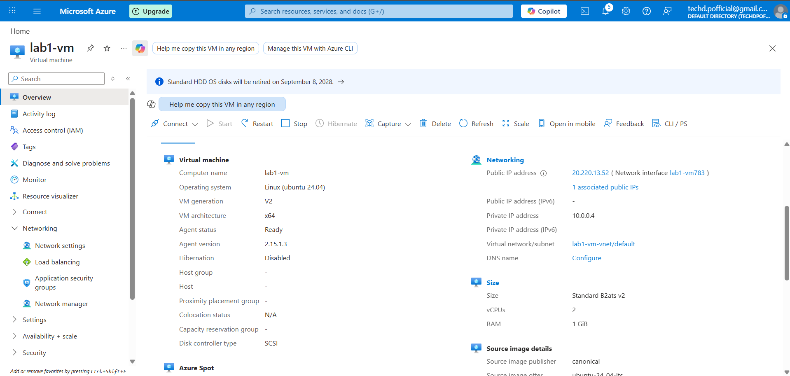
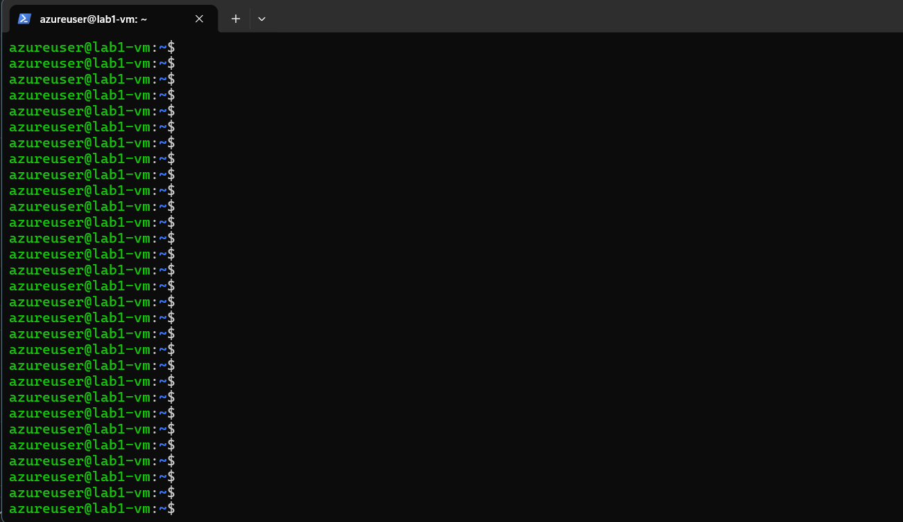
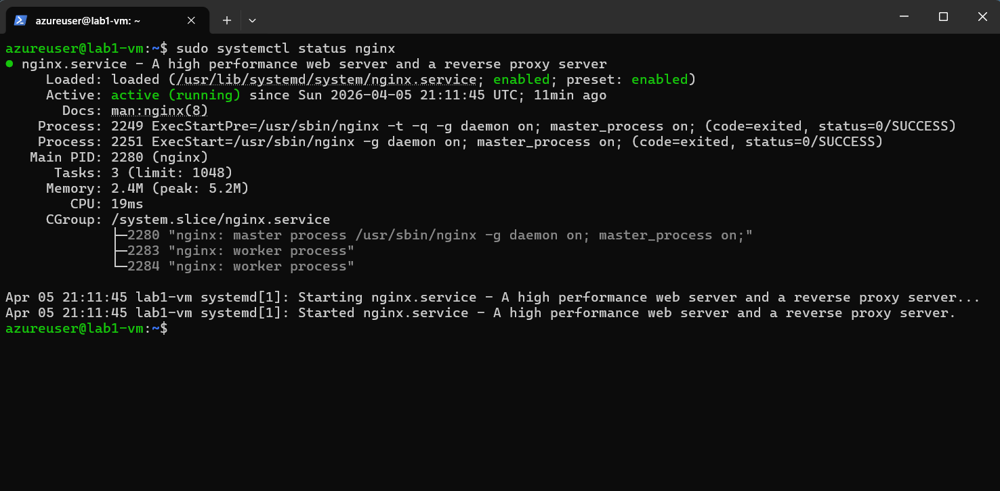
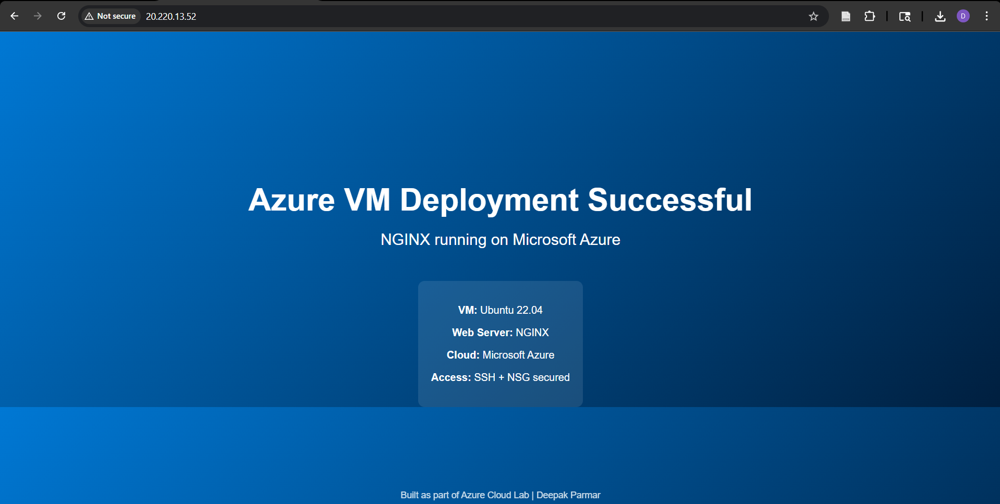

# Azure VM Deployment & NGINX Web Server (Microsoft Azure)

This project demonstrates deploying and securing a Linux Virtual Machine in Microsoft Azure and hosting a custom web page using NGINX.

---

## Technologies Used

* Microsoft Azure
* Ubuntu 22.04 LTS
* NGINX
* SSH
* Azure Virtual Network
* Network Security Groups (NSG)

---

## Step 1 — Azure Virtual Machine Deployment

Created an Ubuntu 22.04 virtual machine in Microsoft Azure using a cost-efficient configuration.

Configuration:

* Size: B1s
* Authentication: SSH key
* Region: Canada Central
* Username: azureuser

---

## Step 2 — Secure SSH Connection

Connected to the Azure VM using SSH key authentication:

ssh -i key.pem azureuser@<public-ip>

This establishes a secure remote connection to the Linux server.

---

## Step 3 — Install and Start NGINX

Updated packages and installed NGINX web server:

sudo apt update
sudo apt install nginx -y

Started the web server:

sudo systemctl start nginx

Verified service status:

sudo systemctl status nginx

---

## Step 4 — Configure Azure Firewall (NSG)

Configured inbound security rules to allow only required traffic:

* Port 22 — SSH access
* Port 80 — HTTP web traffic
* All other inbound traffic restricted

This ensures the VM is securely accessible.

---

## Step 5 — Custom Demo Webpage

Replaced the default NGINX page with a custom demo webpage hosted on the Azure VM.

Accessed using:

http://<public-ip>

---

## Architecture

Local Machine → SSH → Azure VM → NGINX → Browser

---

## What I Learned

* Deploying Azure Virtual Machines
* SSH key authentication
* Linux server management
* Installing and managing NGINX
* Azure Networking and NSG rules
* Hosting a web server in Azure
* Cloud troubleshooting and connectivity

---

## Author

Deepak Parmar
Azure Cloud Lab Series — Lab 1
